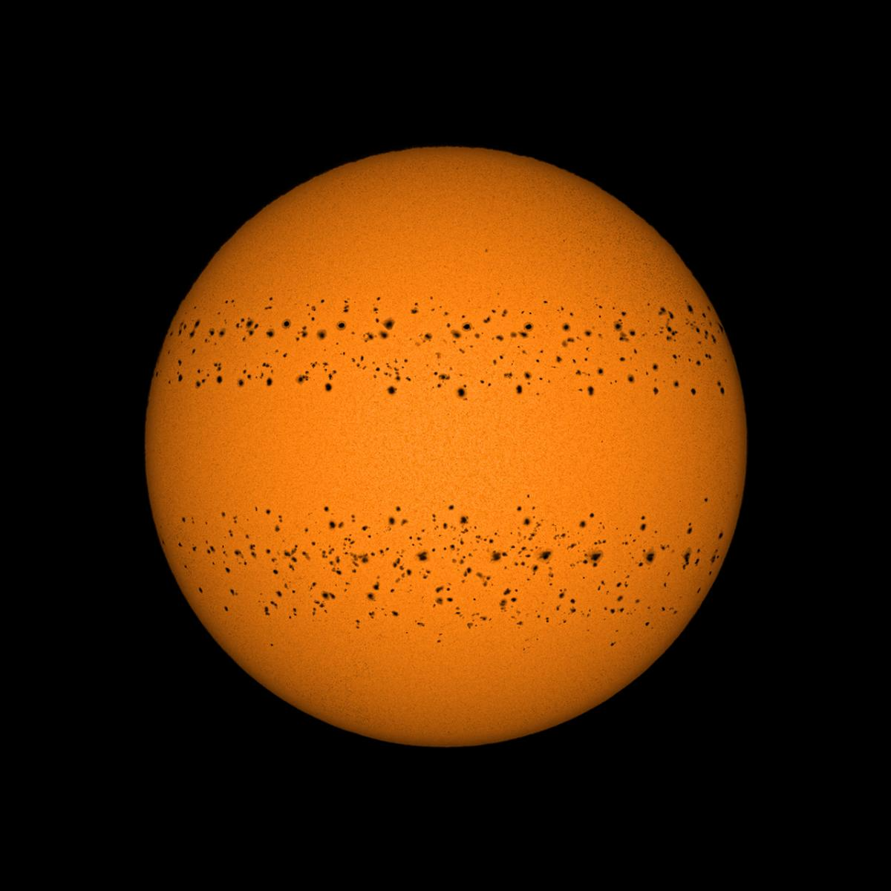

```{r, echo=FALSE}
htmltools::img(src = knitr::image_uri("QMlogo.png"), 
                alt = 'logo', 
               style = 'position:absolute; top:0; right:0; padding:10px; width:20%;')
```

# 1.Background:
As per the definition from the Royal Museums Greenwich, sunspots are cooler parts of the Sun's surface caused by massive changes in the Sun's magnetic field. In other words, sunspots are the darker-looking areas on the surface of the Sun that appear due to changes in the Sun's magnetic field. (Sunspots, no date c) 

Included below is an image of sunspots by Photographer Soumyadeep Mukherjee:

```{r, echo=FALSE, out.width="62.5%", fig.cap="A Year in the Sun"}

```


Before starting this project, we need to consider two questions, namely:
&nbsp;

-  Why do sunspots occur?
&nbsp;
- And, why do we want to model sunspots?
  
## Why do sunspots occur?
Based on the generally accepted theory proposed by H. Babcock in 1961, sunspots are caused by changes in the Sun's magnetic field. It's when the Sun rotates faster at the equator than the poles, creating a differential rotation. This causes the magnetic fields to wound up as the Sun rotates, stretching the magnetic field between the poles and the equators. This stretching then causes tubes or tunnels to form in the magnetic field, which then rise, breaking the surface and preventing the transmission of the gases underneath resulting in areas of lower temperature, which are subsequently seen as dark spots.(Sunspots, no date c)

## Why do we want to model sunspots?
To answer this, we must first understand the Sun. 
&nbsp;

The Sun is a highly active, complicated body whose behaviour changes over time and can affect the Earth's climate, though the impact it has is said to be not as significant. For this reason, it remains an interesting topic for discussion. 
&nbsp;

At its peak, sunspots are said to release 0.1% more energy to the Earth, which can subsequently increase the global average temperature by 0.05-0.1 degrees celsius.(McLachlan, no date) Though this may seem insignificant, it really is not, as this mild increase could lead to many other significant events unfolding. 

# 2.Purpose of Project:
We are now drawn to the purpose of my project, which is to forecast future sunspots, which can then be used to predict their possible impacts on the Earth and global warming.

# 3.Prophet:
Before starting the modelling, I thought it would be good to have an understanding of Prophet and what it entails. Prophet is an easy-to-use forecasting tool developed by Meta to forecast time series data, specifically data that exhibits patterns like trends, seasonality and residual errors. Because of its function, it proves to be a useful tool in the modelling of the sunspots time series .

# 4. Project; Sunspots Time Series:

We begin our modelling by firstly looking at the decomposition of the original sunspots time series. We then load the Prophet function, which will be followed by a series of codes that will create a: data frame for the time series, forecasting model that should forecast 8 periods ahead, a plot showing the historical and forecasted data regarding the time series and specialised plots specific to Prophet before concluding with an overview on the linear regression of the forecasted model.

```{r}
plot(decompose(sunspots))
```

The first line of code creates a plot illustrating the decomposition of the time series into its relevant components. It decomposes the time series into four charts showing the: original time series, trend, seasonality and residual error.

- OBSERVED:

The OBSERVED chart shows the original sunspots time series, which shows the number of sunspots recorded between 1749 and 1983. We see that for the most part the time series data exhibits regular patterns.

- TREND:

The trend appears to show a cyclical pattern that has peaks and troughs throughout. Upon further research, it can be concluded that the number of sunspots follows an 11 year cycle, of which was first noted by Heinrich Schwabe in 1843. (Sunspots, no date c)

- SEASONALITY:

The seasonality of the time series data does not appear to show any regular pattern.

- RESIDUAL ERROR:

The residual error shows all the noise in the sunspots time series having removed the trend and seasonality.

```{r}
library(prophet)
sunspots.df = data.frame(
  ds=zoo::as.yearmon(time(sunspots)), 
  y=sunspots)
```

We now move on to the next few lines of code. Here we have the Prophet function being imported from the library. We use the function to forecast time series data exhibiting trends, seasonality and noise. The function can then be used to create a data frame.

```{r}
sunspots_forecasting_model = prophet::prophet(sunspots.df)
```

This line of code creates a forecasting model using the Prophet function and data frame.

```{r}
forecasts_of_future_sunspots = prophet::make_future_dataframe(sunspots_forecasting_model, periods=8, freq="quarter")
```

The lines of code here create a data frame forecasting future sunspots. 

For the purpose of the project, future sunspots were modelled 8 quarters (2 years) ahead. It is important to note that it is possible to forecast a shorter or longer time period, however forecasting carries a certain confidence interval and so forecasting a longer time period would mean that the confidence intervals become wider, making the forecasts produced less useful.

```{r}
results_future_forecasts_of_sunspots = predict(sunspots_forecasting_model, forecasts_of_future_sunspots)
```

This line of code uses the predict function to generate forecasts for future sunspots.

```{r}
plot(sunspots_forecasting_model,results_future_forecasts_of_sunspots, xlab="years", ylab="number of sunspots")
```

This plot shows the historical and forecasted data of sunspots. It has "years" on its x-axis and the "number of sunspots" on its y-axis. 

The plot is characterised as follows, it has:

- Black points representing the actual observed number of sunspots, recorded monthly

- A blue line representing the Prophet generated forecasts of the number of sunspots (for both historical and forecasted data)

- And, lastly light blue shading representing the confidence interval with which the Prophet generated forecasts are expected to fall in with certain probability.

```{r}
prophet_plot_components(sunspots_forecasting_model, results_future_forecasts_of_sunspots)
```

This plot illustrates the trend and seasonality of the Prophet forecasting model.

From it, we can observe that the trend has a relatively stable decline around the years of 1749 to 1815, from which there appears to be an incline with a peak around 1850 before it starts to decline once more until around 1900 where there appears to be a sharp increase in trend. Overall, the trend of the Prophet model is somewhat in contrast to the original time series. Whilst, it does catch a peak and two troughs, it does not accurately display the cyclical nature of the time series trend.

From the plot, we are also able to observe the seasonality of the model, which in contrast to the original time series appears to show a pattern (albeit a somewhat irregular one)

```{r}
dyplot.prophet(sunspots_forecasting_model, results_future_forecasts_of_sunspots)
```

The above dyplot is an interactive example of the first plot, showing the historical and forecasted data of sunspots. It produces figures of the actual observed number of sunspots and compares this to the Prophet forecasted number. 

From the dyplot, we can observe that the blue line representing the Prophet generated forecasts varies from the actual observed forecasts as the Prophet generated forecasts do not account for the large fluctuations present in the actual observed forecasted data. For this reason, it could be said that the future forecasts for sunspots generated using Prophet could be either under or over predicted.

We now move on to conducting a linear regression and summary of the data frame.

```{r}
Sslm = lm(y~ds, data=sunspots.df)
summary(Sslm)
```

From the summary produced, we can extract the following information, namely that the:
&nbsp;

1. Beta of the regression model is 0.10027
&nbsp;
2. Standard error of the beta estimate is 0.01191
&nbsp;
3. P-value is <2e-16 
&nbsp;
4. And, the R-squared value is 0.02452

Given the information, we can conclude that the:
&nbsp;

1. The number of sunspots increases by 0.10027 per unit increase
&nbsp;
2. The standard error of the beta estimate is very low => it is quite precise
&nbsp;
3. The p-value which is more or less equal to 0 => the regression model is statistically significant 
&nbsp;
4. And, the low R-squared =>  the regression model can only explain 2.452% of the variability in the number of sunspots.

Overall, whilst it can be said that the model is statistically significant, it is not the best as it only explain 2.452% of the variability.

# 5. References:
Sunspots (no date c). https://www.rmg.co.uk/stories/topics/sunspots.


McLachlan, R. (no date) Climate explained: Sunspots do affect our weather, a bit, but not as much as other-things. https://theconversation.com/climate-explained-sunspots-do-affect-our-weather-a-bit-but-not-as-much-as-other-things-145101.


